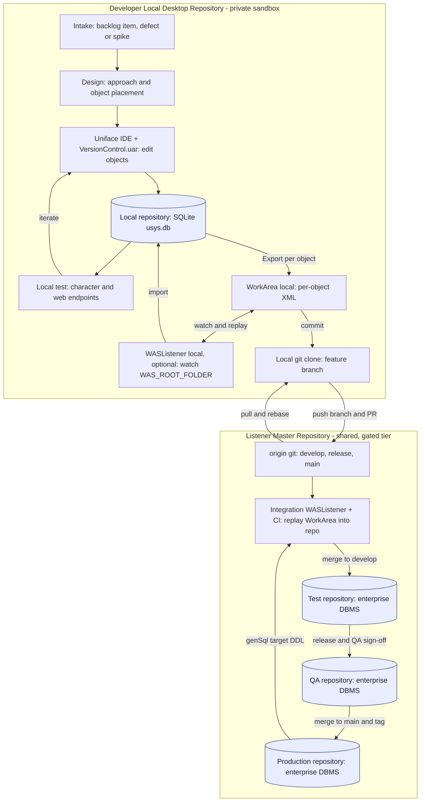
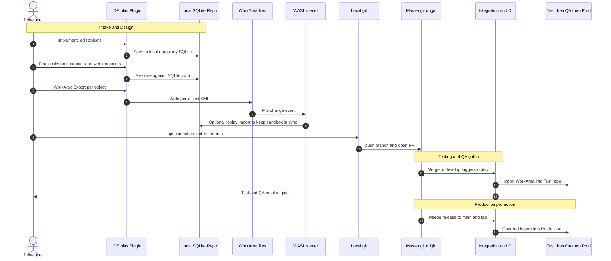
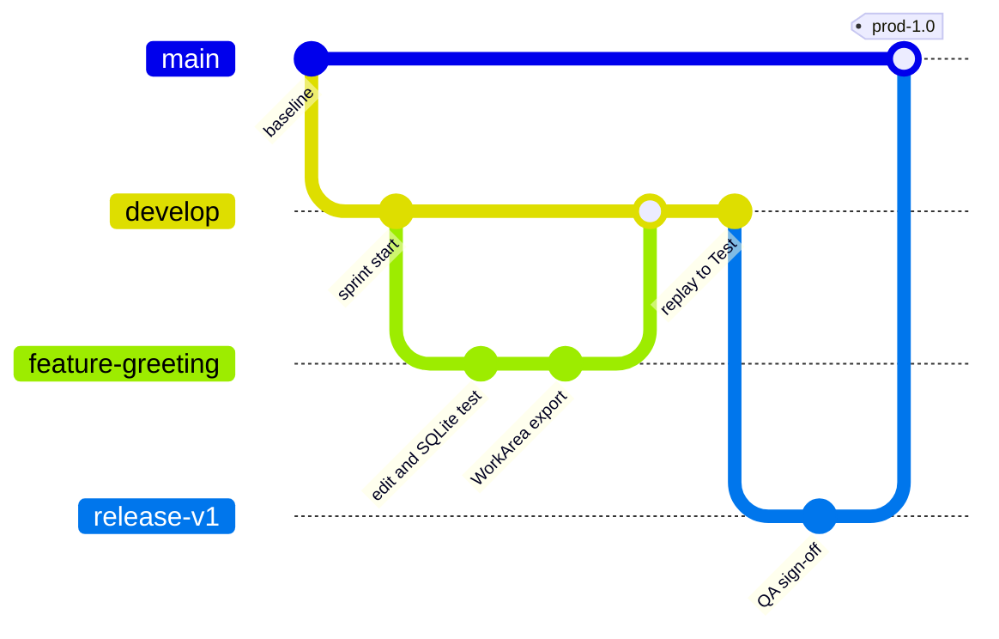

# 032 SDLC & Agile delivery on the WorkArea + WASListener architecture — staged-environment emulation

| Field | Detail |
| --- | --- |
| **Date** | 2026-07-02 |
| **Purpose** | Turn a verified local toolchain — a **SQLite** repository sandbox, a Git-tracked **WorkArea** serialization, the **VersionControl.uar** IDE plugin, and the native **`WASListener.exe`** watcher — into a coherent story of how one change travels **intake → design → implementation → testing → QA → production**, driven by **branched Git changes** in a shared *listener master repository* versus a *developer local desktop repository*. |
| **Diagrams** | Mermaid **flowchart**, **sequence**, and **gitGraph** (§7). |
| **Status** | 💡 **Design proposal** — the *components* are verified on this install; the *workflow / branching model* here is a proposed, teachable convention, not behaviour the engine enforces. The guardrails in §8 are verified cautions. |

---

## 1. Why this architecture is a learning instrument

A junior developer rarely gets to *see* how one enterprise change crosses **dev → test → QA →
prod** with separate databases, separate approvals, and a controlled promotion. This workspace
lets a single laptop **emulate that whole pipeline**:

- The **local SQLite repository** (`usys.db`) is a throwaway **sandbox** — fast to reset, safe
  to break, private to the developer.
- The **WorkArea** tree is the **portable, diffable serialization** — the only thing Git and
  other environments actually exchange (never the live database).
- **`WASListener.exe`** is the **automation bridge** — it watches the WorkArea and replays
  file↔repository sync, standing in for the CI/promotion robot an enterprise runs per
  environment.
- **Git branches** are the **promotion control plane** — which branch a WorkArea state lives on
  decides which *environment* receives it.

The payoff: you practise the enterprise motions (branch, review, promote, gate) at zero
infrastructure cost, and you internalise that **the repository is the source of truth and the
WorkArea/Git is how it travels**.

## 2. The two repositories (the core distinction)

| | **Developer local desktop repository** | **Listener master repository** |
| --- | --- | --- |
| **Uniface repo DB** | Local **SQLite** `usys.db` (personal sandbox) | Shared/staged repos, usually **enterprise DBMS** (Oracle / SQL Server) per environment |
| **WorkArea** | Local tree the dev exports into | The same tree, arrived via Git merge |
| **Git** | Local clone, **feature branches** | `origin` — `develop` / `release` / `main` (authoritative history) |
| **WASListener role** | Optional local watcher: keeps SQLite repo ↔ local WorkArea in sync while iterating | Integration/CI watcher: **replays merged WorkArea XML into each environment repo** |
| **Who mutates it** | The one developer | Merges + gated promotions only |

**Rule of thumb:** *edit locally against SQLite → serialize to the WorkArea → move via Git → let
a WASListener materialize it into the next environment.* The database never travels; the
**WorkArea XML + Git branch** do.

## 3. The developer inner loop — local-first testing with SQLite

1. **Pull & branch.** Pull the master, cut a feature branch in the local clone.
2. **Edit in the IDE.** Change objects (component / entity / ProcScript) in the structured
   editors; they save into the **local SQLite repository** — nothing shared is touched yet.
3. **Test locally, on the real endpoints.** Run the object against SQLite data — the app's
   targets are **character-mode Forms and web DSP/USP**, not GUI. SQLite makes reset/retry
   cheap; iterate until green.
4. **Export to the WorkArea.** WorkArea Export (per object, never *Export All*) writes the
   diffable per-object XML into the class subfolders.
5. **Commit & push.** Commit the WorkArea change on the feature branch; push and open a PR
   against the master repository.
6. **Promote by merge.** Review → merge → the integration **WASListener/CI** replays the
   WorkArea into the **Test** repository, then QA, then Production — each gated (§5–§6).

Bridging SQLite → enterprise DBMS on promotion is **`/genSql`**: generate the target-DBMS DDL
(SQLite-dev → Oracle/SQL-Server-prod) so the schema materializes correctly in each upstream
environment.

## 4. Stage → branch → repository mapping (generic SDLC)

| SDLC stage | Where | Git action (branch) | Repository (DB) | WorkArea / WASListener |
| --- | --- | --- | --- | --- |
| **Intake** | Backlog | issue → `feature` cut from `develop` | — | — |
| **Design** | Local + notes | approach on the branch; agree object placement | Local SQLite | — |
| **Implementation** | Local desktop | commits on `feature` | Local **SQLite** sandbox | Export → WorkArea; local watcher optional |
| **Testing** (dev) | Local + CI | push branch, PR to `develop` | Local SQLite, then **Test** repo | Merge → integration WASListener import into Test |
| **QA** | Shared | `release` cut from `develop` | **QA** repo (enterprise DBMS) | Promote WorkArea to QA repo; gated sign-off |
| **Production** | Shared | merge `release` → `main`, **tag** | **Production** repo | Guarded WASListener import into Prod |

## 5. Generic SDLC path (narrative)

A single, controlled flow: **Intake** captures a work item and opens a branch; **Design**
records the approach and *where* logic lives (model vs presentation) so it behaves the same on
every endpoint; **Implementation** happens on the local SQLite sandbox and is exported to the
WorkArea; **Testing** begins locally and continues after the PR merges into the shared **Test**
repo via the integration WASListener; **QA** takes a release cut into a QA repository for formal
sign-off; **Production promotion** merges the release to `main`, tags it, and a **guarded**
WASListener import materializes it into Prod. Each environment is a *different repository DB*;
the *same WorkArea XML* flows through them under Git control.

## 6. Agile path (the same pipeline, iterated)

Agile doesn't change the *plumbing* — it changes the *cadence and gates*:

- **Sprint intake / refinement** → backlog items become short-lived feature branches; small
  batches so each WorkArea diff is reviewable per object.
- **Design is continuous** → just-enough design in the story; placement decisions captured in
  the PR, not a separate phase.
- **Implementation + Testing collapse** → TDD-style local loops against **SQLite** (fast reset)
  with the character/web endpoints exercised each iteration.
- **CI on every PR** → merge to `develop` auto-replays the WorkArea into the **Test** repo; a
  red import blocks the merge (import exit code gate).
- **QA as a Definition-of-Done gate** → a release branch promotes to the QA repo; QA sign-off is
  the DoD, not a downstream hand-off.
- **Production promotion each sprint (or on demand)** → merge to `main` + tag; a **guarded**
  import. Trunk-friendly: keep feature branches short and integrate often.

**Environments map to branches; iterations map to how often you promote.** The architecture is
identical; Agile just runs it faster and with tighter feedback.

## 7. Diagrams

> The diagrams are intentionally detailed so they stay legible when this Markdown is
> exported/printed; each may span a page.

### 7.1 Promotion pipeline (flowchart)

### 7.2 One change's lifecycle (sequence)

### 7.3 Branch model (gitGraph)

## 8. Guardrails (verified — do not skip)

- **WASListener/plugin Import is destructive** — it performs `Delete <object>` then
  `Import <object>` for everything under the WorkArea root, with no preview. Automating
  promotion means a bad WorkArea state can **wipe/replace** an environment's objects — so
  **commit/back up the target repo before an import**, and gate on a known-good tree. A safe
  emulation stays **dry-run / preview-first**.
- **Never use Data Copy for definitions** — export/import XML only; a physical copy corrupts and
  its files are rejected by import.
- **Export project objects only** — never the vendor's reserved `USYS*`/`U*` system objects;
  never *Export All*.
- **SQLite is dev-only** — promote schema with **`/genSql`** to the target DBMS; production
  compiles are **`/all /nodebug`** (non-debuggable).
- **Placement for portability** — keep data/business rules in the **model / entity services** so
  they behave identically on every endpoint; presentation components stay thin.

## 9. Takeaways for a new developer

1. **You never move the database.** You move **WorkArea XML on a Git branch**; a WASListener
   rebuilds the objects in the next environment.
2. **SQLite is your safety net** — iterate hard locally, then export.
3. **A branch *is* an environment ticket** — feature = your desk, `develop` = Test, release =
   QA, `main` + tag = Production.
4. **Promotion is a controlled import**, and import is destructive — treat every promotion as a
   guarded, reviewed action.

---

## References (external to this document)

*This document is self-contained. The items below are pointers only — internal project notes and
licensed product documentation are not reproduced here.*

- *Internal project working notes (not shared with this document): the WorkArea sync,
  repository-as-source-of-truth, CLI/build-hygiene, character-mode/web-endpoint, and
  trigger-placement conventions; the WorkArea design note and on-disk folder contract.*
- *Internal project history (not shared): earlier session logs covering the WorkArea
  introduction, first push, the first round-trip (destructive-import finding), and the native
  `WASListener.exe` build.*
- ***External, gated product documentation** — licensed; consult under your Rocket Uniface
  entitlement:* Rocket Uniface Library 10.4 — *Work Area Support; assignment-file settings;
  `/genSql` schema generation; `/imp` import and exit codes; character-mode and DSP/USP
  rendering.*
